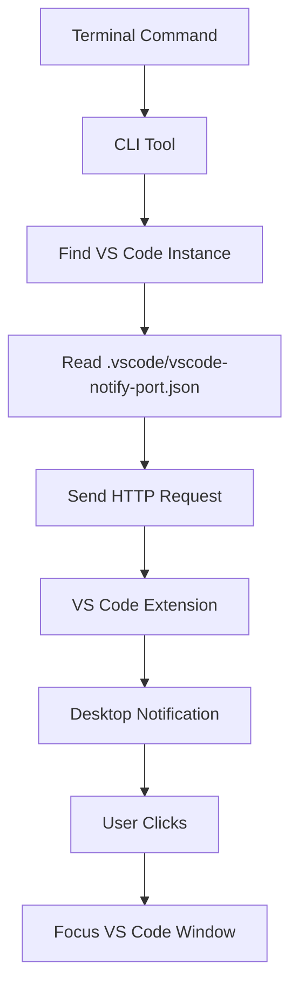

# VS Code Notify 🔔

Send desktop notifications from your terminal that can focus specific VS Code instances! This extension displays native OS notifications that appear outside of VS Code, allowing you to stay aware of important events across all your workspaces and quickly switch to the relevant project.


## ✨ Features

- 🖥️ **Native Desktop Notifications**: Notifications appear in your system's notification center (macOS Notification Center, Windows Action Center, Linux notify-send)
- 🎯 **Click-to-Focus**: Clicking a notification brings the exact VS Code window/workspace to the front
- 🏢 **Multi-Workspace Aware**: Each notification shows which workspace it came from with clear workspace names
- 🔄 **Background Visibility**: Notifications appear even when VS Code is minimized or you're working in other applications
- 🌍 **Cross-Platform**: Works seamlessly on macOS, Windows, and Linux
- ⚡ **Zero Configuration**: Automatic port management handles multiple VS Code instances without conflicts
- 🎨 **Visual Types**: Different icons for info (ℹ️), warning (⚠️), and error (❌) notifications

## 🚀 Installation

### From VS Code Marketplace
1. Open VS Code
2. Go to Extensions (Ctrl+Shift+X / Cmd+Shift+X)
3. Search for "VS Code Desktop Notify"
4. Click Install

### CLI Installation
After installing the extension, install the command-line tool:

```bash
# Install globally (recommended)
npm install -g vscode-notify-desktop

# Or install locally in your project
npm install vscode-notify-desktop

# Or use without installing
npx vscode-notify-desktop "Your message"
```

**Note**: The command is now `vscode-notify-desktop` for full consistency.

## 📖 Usage

### Basic Notifications

```bash
# Simple info notification
vscode-notify-desktop "Build completed successfully!"

# Warning notification
vscode-notify-desktop "Low disk space detected" --type warning

# Error notification  
vscode-notify-desktop "Tests failed!" --type error
```

### Real-World Examples

```bash
# After a long build process
make build && vscode-notify-desktop "✅ Build completed" || vscode-notify-desktop "❌ Build failed" --type error

# Git hooks
git commit && vscode-notify-desktop "📝 Commit successful"

# Test runs
npm test && vscode-notify-desktop "✅ All tests passed" || vscode-notify-desktop "❌ Tests failed" --type error

# Deployment notifications
deploy.sh && vscode-notify-desktop "🚀 Deployment successful" --type info

# Long-running scripts
./long-process.sh; vscode-notify-desktop "Process finished" --type info
```

### Advanced Usage

```bash
# Target specific VS Code instance by port
vscode-notify-desktop "Custom message" --port 7532

# Broadcast to all running VS Code instances
vscode-notify-desktop "Important announcement" --all

# Show all available options
vscode-notify-desktop --help
```

## 🔧 How It Works



1. **Extension Startup**: When VS Code starts, the extension creates an HTTP server on an available port (7531-7540)
2. **Port Discovery**: Port information is saved to `.vscode/vscode-notify-port.json` in your workspace
3. **CLI Detection**: The CLI tool automatically finds the correct VS Code instance based on your current directory
4. **Notification Delivery**: Sends notification data via HTTP POST to the extension
5. **Desktop Display**: Extension shows native OS notification with workspace context
6. **Click Handling**: Clicking the notification opens and focuses the specific VS Code workspace

## 🏢 Multiple Workspaces

Perfect for developers working with multiple projects simultaneously:

### Automatic Instance Detection
- Each VS Code window gets its own unique port
- CLI automatically detects which workspace you're in
- Notifications show clear workspace names in the title

### Example Scenario
```bash
# Terminal in ~/projects/frontend
cd ~/projects/frontend
vscode-notify-desktop "Frontend build complete"
# Shows: "ℹ️ frontend - Frontend build complete"

# Terminal in ~/projects/backend  
cd ~/projects/backend
vscode-notify-desktop "API tests passed" --type info
# Shows: "ℹ️ backend - API tests passed"
```

### Manual Control
```bash
# Send to specific instance
vscode-notify-desktop "Message" --port 7533

# Send to all instances
vscode-notify-desktop "Server maintenance in 5 minutes" --all
```

## 🛠️ Development & Contributing

### Setup Development Environment
```bash
# Clone the repository
git clone <repository-url>
cd vscode-notify

# Install dependencies
npm install

# Compile TypeScript
npm run compile

# Watch for changes during development
npm run watch

# Run tests
npm test

# Package extension
npm run package
```

### Project Structure
```
vscode-notify-desktop/
├── src/
│   └── extension.ts              # Main extension code
├── cli/
│   └── vscode-notify-desktop.js  # Command-line interface
├── out/                          # Compiled JavaScript
├── package.json                  # Extension manifest
└── README.md                     # This file
```

### Architecture
- **Extension**: HTTP server with desktop notification integration
- **CLI**: Lightweight Node.js script for sending notifications
- **Communication**: JSON over HTTP with automatic port discovery
- **Focus**: Platform-specific window focusing using OS commands

## 🐛 Troubleshooting

### Common Issues

**Notifications not appearing:**
```bash
# Check if extension is running
ls .vscode/vscode-notify-desktop-port.json

# Test with explicit port
vscode-notify-desktop "test" --port 7531

# Check VS Code developer console
# Help > Toggle Developer Tools > Console
```

**Wrong VS Code instance focused:**
```bash
# Ensure you're in the correct directory
pwd

# Check port file contents
cat .vscode/vscode-notify-desktop-port.json

# Use specific port if needed
vscode-notify-desktop "message" --port 7532
```

**CLI not found:**
```bash
# Reinstall globally
npm install -g vscode-notify-desktop

# Or use npx
npx vscode-notify-desktop "message"
```

### Platform-Specific Notes

**macOS:**
- Notifications appear in Notification Center
- Requires notification permissions for VS Code
- Click-to-focus uses `open` command

**Windows:**
- Notifications appear in Action Center
- Works with Windows 10/11 toast notifications
- Focus behavior may vary based on Windows version

**Linux:**
- Uses `notify-send` or similar notification daemon
- Requires notification service to be running
- Focus behavior depends on window manager

## 📋 Requirements

- **VS Code**: Version 1.102.0 or higher
- **Node.js**: Version 14 or higher (for CLI tool)
- **Operating System**: macOS, Windows 10+, or Linux with notification support

## 🤝 Contributing

We welcome contributions! Please see our [Contributing Guide](CONTRIBUTING.md) for details.

### Areas for Contribution
- 🌐 Improved cross-platform compatibility
- 🎨 Custom notification themes
- 📱 Mobile integration (VS Code on tablets)
- 🔧 Additional CLI options
- 📚 Documentation improvements

## 📄 License

MIT License - see [LICENSE](LICENSE) file for details.

## 🙏 Acknowledgments

- Built with [node-notifier](https://github.com/mikaelbr/node-notifier) for cross-platform notifications
- Inspired by the need for better developer workflow integration
- Thanks to the VS Code extension community for guidance and best practices

---

**Made with ❤️ for developers who love staying informed across multiple projects**

[Report Issues](https://github.com/ssv445/vscode-notify-desktop/issues) | [Request Features](https://github.com/ssv445/vscode-notify-desktop/issues) | [View Source](https://github.com/ssv445/vscode-notify-desktop)
